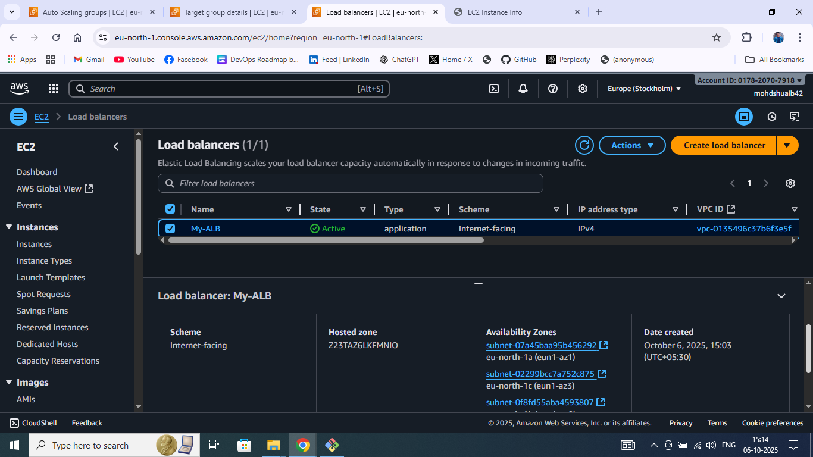
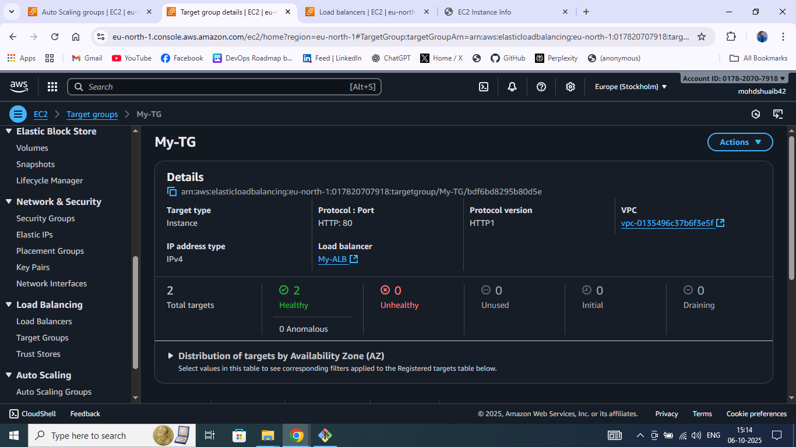
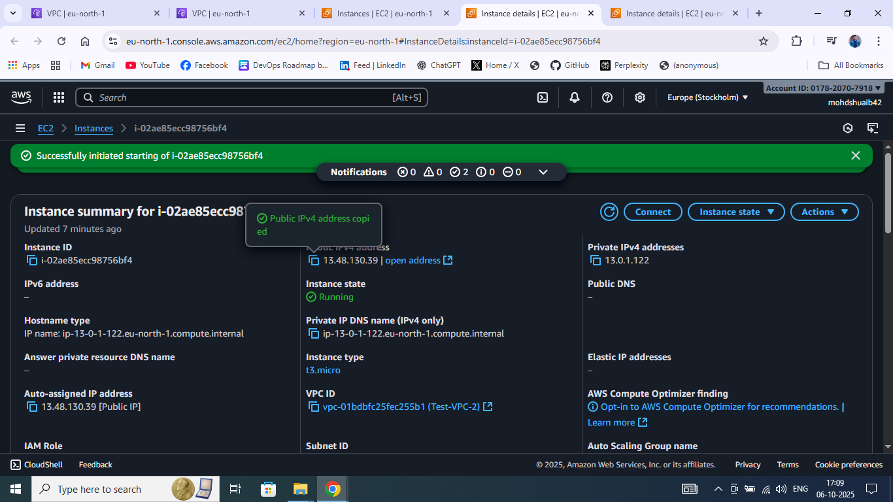

## 1: 
Created custom policy InternS3UploadPolicy

Allowed only s3:PutObject and s3:GetObject on prefix uploads/*
Created IAM user intern-uploader for testing.

Attached policy InternS3UploadPolicy to intern-uploader via AWS CLI.

Configured AWS CLI with user credentials (aws configure --profile intern-uploader).

Tested upload (success):

aws s3 cp sample.txt s3://intern-assignments-YOURNAME/uploads/sample.txt

✅ File uploaded successfully.

Tested delete (fail):

aws s3 rm s3://intern-assignments-YOURNAME/uploads/sample.txt

❌ AccessDenied confirmed (delete explicitly denied).

Validated permissions with IAM Policy Simulator (optional check).
[text](README.MD)    
Cleanup: Removed test object, detached policy, deleted user and policy.

Result:
Verified that the IAM user can upload and read files under uploads/ prefix but cannot delete them.
This confirms principle of least privilege is correctly implemented.

## 2:
Launched EC2 instance

AMI: Amazon Linux 2

Instance type: t2.micro

Key pair and default VPC/subnet used

Security Group configured to allow HTTP (port 80) and SSH (port 22)

Added User Data Script to automate setup during launch:

#!/bin/bash
yum update -y
yum install -y httpd
systemctl enable httpd
systemctl start httpd
echo "<h1>Hello from $(hostname -f)</h1>
Private IP: $(hostname -I)
" > /var/www/html/index.html

Instance launched successfully

Instance ID: i-xxxxxxxxxxxxxxxxx

Public IP: xx.xx.xx.xx

Verified Web Page

Opened browser → http://<public-ip>

Displayed hostname and private IP as expected.

Tested via CLI
[text](README.MD)      

## 3:
Created new EBS volume

Type: gp3

Size: 8 GB

Availability Zone: same as EC2 instance (e.g., ap-south-1a)

Volume ID: vol-0a1b2c3d4e5f6g7h8

Attached volume

Attached to EC2 instance from Task 1 as /dev/xvdf

Verified attachment via console and CLI:

lsblk

Formatted and mounted volume

sudo mkfs -t ext4 /dev/xvdf
sudo mkdir /data
sudo mount /dev/xvdf /data

Verified mount:

df -h

Made mount persistent on reboot

echo "/dev/xvdf /data ext4 defaults,nofail 0 2" | sudo tee -a /etc/fstab

Created sample file for verification

echo "hello" > /data/test.txt
cat /data/test.txt

Created snapshot of the volume

aws ec2 create-snapshot --volume-id vol-0a1b2c3d4e5f6g7h8 --description "Backup snapshot"

Snapshot ID: snap-0123abc456def7890

Detached and restored volume

Detached original volume from instance.

Created new volume from snapshot:

Restored Volume ID: vol-0987g6f5e4d3c2b1a

Attached new volume as /dev/xvdf.

Verified restored data

sudo mount /dev/xvdf /data
cat /data/test.txt
[text](README.MD)     

## 4:
Go to EC2 → Instances → select your existing instance (which already has a web server and mounted data volume).

Click Actions → Image and templates → Create image.

Give it a name like: web-ami.

(Optional) Add a description.

Click Create image.

Wait until the AMI status becomes available under EC2 → AMIs.

Step 2: Launch a New Instance from the AMI

Go to EC2 → AMIs → select your newly created AMI.

Click Launch instance from image.

Choose instance type (e.g., t2.micro).

Select an existing key pair.

Choose the same VPC/subnet (for easy SSH access).

Under Security Group, allow HTTP (port 80) and SSH (port 22).

Launch the instance.

Step 3: Verify the Web Server and Page

Once the new instance is running, copy its Public IP.

Open a terminal or browser:

curl http://<public-ip>

You should see the same HTML page (hostname, IP, etc.) as the original instance.

Step 4: Create and Test Snapshot of Data Volume

Go to EC2 → Volumes.

Select the data volume attached to your original instance (not the root one).

Click Actions → Create snapshot.

Give it a name like data-volume-snapshot.

Wait for the snapshot to complete.

Go to Snapshots → select it → Actions → Create volume from snapshot.

Choose the same Availability Zone as your new instance.

Click Create volume.

Attach the new volume:
   

## 5:

Create Target Group

Go to EC2 → Target Groups → Create Target Group.

Type: Instances, Protocol: HTTP:80, VPC: your VPC.

Health check: /. Name it tg-intern.

Create Application Load Balancer

Go to Load Balancers → Create ALB.

Scheme: Internet-facing, Type: Application Load Balancer.

Choose 2 public subnets (different AZs).

Add HTTP listener (port 80) → forward to tg-intern.

Create Launch Template

Go to Launch Templates → Create template.

Name: lt-intern-web.

AMI: Amazon Linux 2, Type: t3.micro.

Enable IMDSv2 (HttpTokens=required).

Encrypt root volume.

Add this User Data:

#!/bin/bash
yum update -y
yum install -y httpd
echo "<h1>Hostname: $(hostname)</h1>
Private IP: $(hostname -I)
" > /var/www/html/index.html
systemctl enable httpd
systemctl start httpd

Create Auto Scaling Group

Go to Auto Scaling Groups → Create ASG.

Name: asg-intern.

Use lt-intern-web.

Subnets: same 2 public subnets as ALB.

Attach to Target Group (tg-intern).

Set capacity: min=1, desired=2, max=3.

Launch and wait until 2 instances are healthy in the target group.

Test
     

## 6:
Create Second VPC

Go to VPC → Create VPC.

CIDR: 10.20.0.0/16, name it vpc2.

Create a public subnet 10.20.1.0/24 and enable Auto-assign Public IP.

Launch an EC2 instance in this subnet (name: web-vpc2).

Verify VPC1 Setup

Ensure first VPC (vpc1) already exists with CIDR 10.10.0.0/16.

There should be an EC2 instance (e.g., web-vpc1) in a public subnet (10.10.1.0/24).

Create VPC Peering Connection

Go to VPC → Peering Connections → Create Peering Connection.

Requester: vpc1 (10.10.0.0/16), Accepter: vpc2 (10.20.0.0/16).

Click Create, then Accept the peering request from the other VPC.

Update Route Tables

In VPC1 Route Table:
Add route → Destination: 10.20.0.0/16 → Target: Peering Connection.

In VPC2 Route Table:
Add route → Destination: 10.10.0.0/16 → Target: Peering Connection.

Adjust Security Groups

In both EC2 instances’ Security Groups:

Allow ICMP (ping) from the other VPC’s CIDR.

Optionally allow TCP port 80 for web testing.

Test Communication

SSH into the instance in VPC1.

Run:

ping <private-IP-of-web-vpc2>

or

curl <private-IP-of-web-vpc2>

Successful reply confirms cross-VPC communication via peering.
       