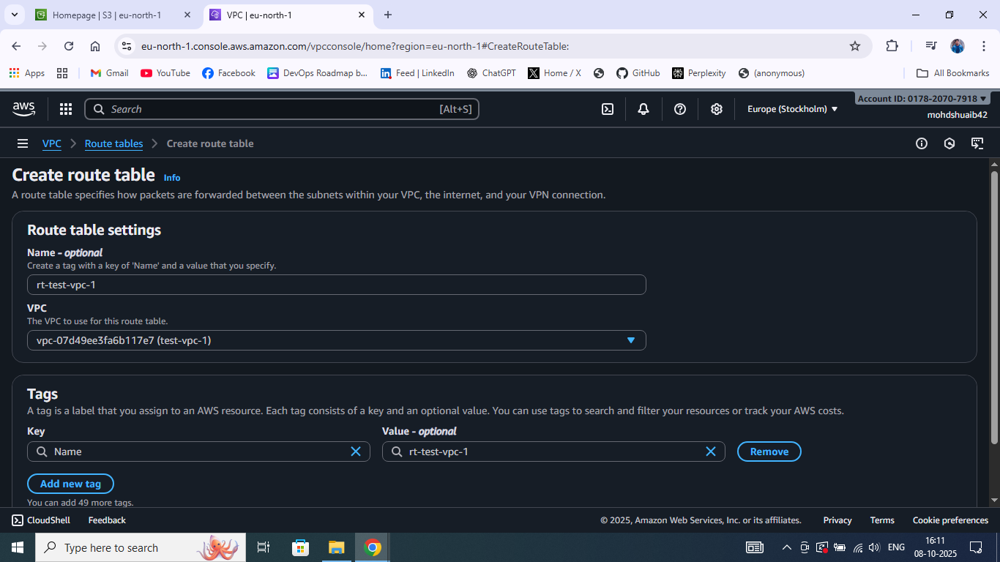

# Connected three VPCs using Transit Gateway

## Each with a public subnet and an EC2 instance.
.png>)

## Configured appropriate security groups to allow ICMP (ping) and HTTP traffic.
.png>)

## Created a Transit Gateway (TGW)
.png>)

## Configured default route table association and propagation.

## Attached Each VPC to the TGW
.png>)
## Used Transit Gateway Attachments to link all three VPCs.

Enabled route propagation in TGW route tables.
Updated VPC Route Tables

Added routes pointing to the Transit Gateway ID for other VPC CIDR ranges.

## Verified Connectivity
Connected to EC2 instances using SSH (from one instance).
.png>)
Used ping and curl commands with private IPs to test connectivity between instances: