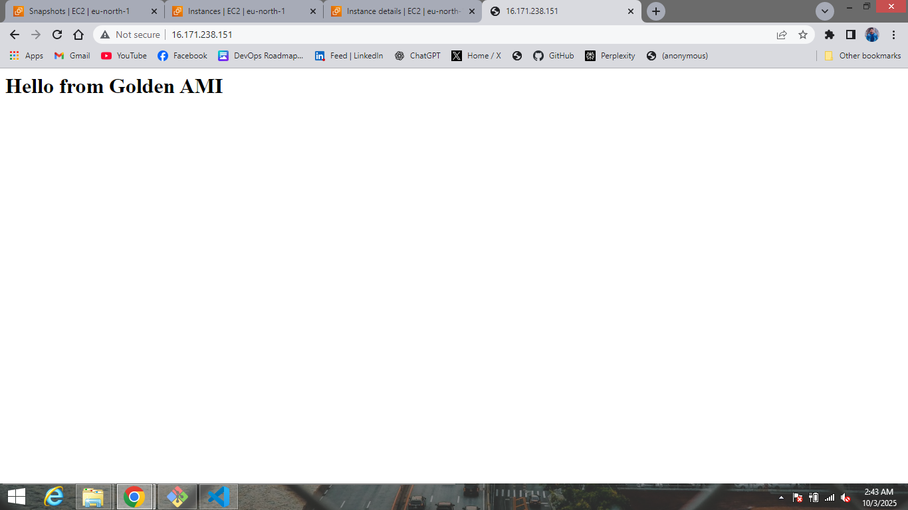

## AWS Lap Excercise 
## 1:Launch a new EC2 instance from a public AMI; attach a fresh gp3 data volume, partition/format/mount it for app data, take a point-in-time snapshot, and provide secure access via both SSH and Session Manager.

Go to EC2 Dashboard → Launch Instance.

Choose a public AMI (e.g., Amazon Linux 2 / Ubuntu).

Select an instance type (e.g., t2.micro for testing).

Configure key pair for SSH access.

Attach a security group allowing:

SSH (port 22) from your IP.

Session Manager access (requires SSM agent + IAM role).

Launch the instance.

2. Attach gp3 Data Volume

From EC2 → Volumes, create a new gp3 EBS volume.

3. Partition, Format & Mount the Volume
Connect to the instance via SSH 

List block devices:

lsblk
Partition the volume:

sudo fdisk /dev/xvdf

Create new partition → write changes.

Format with ext4 filesystem:

sudo mkfs -t ext4 /dev/xvdf1

Create a mount directory:

sudo mkdir /appdata

Mount the volume:

sudo mount /dev/xvdf1 /appdata

Verify:

df -h

4. Take Point-in-Time Snapshot

Go to EC2 → Volumes.

Select the gp3 volume.

Click Actions → Create Snapshot.

Provide description (e.g., App Data Snapshot).

Snapshot will serve as a backup / restore point.

5. Secure Access Setup

SSH Access:

Use key pair (.pem file) with command:

ssh -i my-key.pem ec2-user@<public-ip>

Screenshots for refrence are from t1.0 to t1.6

## 2: Create a simple golden AMI from a configured instance (web/app baseline), then launcha new instance from that AMI and verify the service comes up without any additional manual steps.

Configured a baseline EC2 instance with all required web/app services.
Verified that the instance is working as expected.

Created an AMI from the configured instance (Golden AMI).

Launched a new EC2 instance using the Golden AMI.

Verified that the service started automatically without any manual configuration.

Confirmed that the new instance is fully operational and matches the baseline configuration
Screenshots for refrence are from t2.0 to t2.4

## 3: Migrate application data off the root disk to a separate attached EBS volume, snapshot that data volume, replace the original instance, and restore the data by attaching the volume to the new instance.

Attached a new EBS volume to the running instance.

Migrated application data from the root disk to the new EBS volume.

Created a snapshot of the data volume.

Terminated the original instance and launched a new instance.

Attached the EBS volume to the new instance.

Verified that all application data was restored and services were functioning correctly

Screenshots for refrence are from t3.0 to t3.10

## 4: Restore an EBS snapshot to a new volume in a different Availability Zone, validate data integrity there, then copy the same snapshot to another Region, restore it, and verify cross‑region recovery.

Restored an EBS snapshot to a new volume in a different Availability Zone.

Attached the volume to an instance and validated data integrity.

Copied the snapshot to another AWS Region.

Restored the copied snapshot in the new Region.

Verified that the data was fully intact and services were working in the cross-region instance.
Screenshots for refrence are from t4.0 to t4.2

## 5: Modify an EBS volume in place (size and/or type), expand the filesystem online, and confirm capacity and performance changes without downtime.

Selected the target EBS volume and modified its size/type in place.

Expanded the filesystem on the instance without downtime.

Verified the updated capacity and confirmed improved performance.

Screenshots for refrence are from t5.0 to t5.3

## 6: Create an AMI backup of a running instance, terminate the original, and relaunch a replacement from the AMI to confirm a clean, predictable rebuild.

Created an AMI backup of the running instance.

Terminated the original instance.

Launched a new instance from the AMI.

Verified that the new instance launched cleanly with all configurations intact, ensuring a predictable rebuild.
Screenshots for refrence are from t6.0 to t6.4

## 8: It's done and half of in previous tasks
Screenshots for refrence are from t7.0

