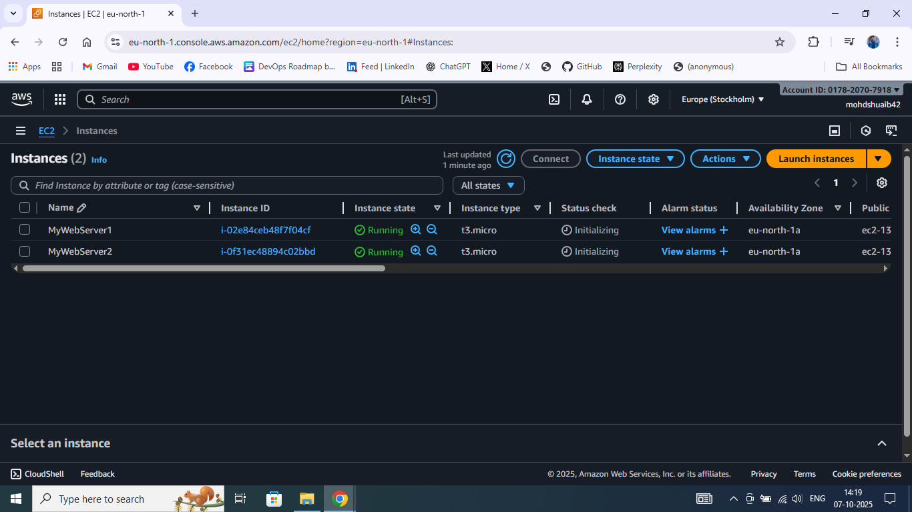
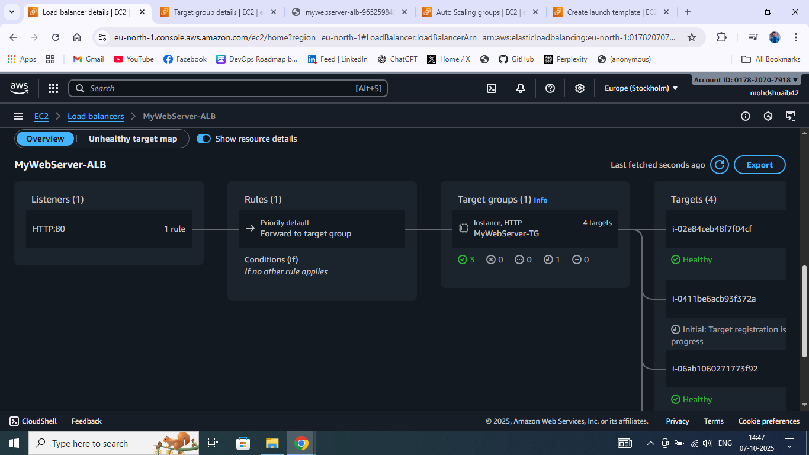

## 1: 

Here we are creating a Launch template to be used in ASG.

Setting up network setting.

Adding user data script for apache webserver and a simple web page.

We already have two EC2s running and serving a simple web-page. 

Now Creating an ALB the traffic distribution.

Here we are creating a target group to the LB route the traffic.

Here we have 0 Healthy instances because we have not registered our instances.

This is the LB in Provisioning state.

Now our LB is working as expected. 

Here we have created the AutoScaling Group for scaling up and down based on demand.

It's the Overview 

## 2:

Here we created a instance to send load to Load Balancer.

Here we are sending huge reqs.. to servers.

As we can see the Requestcount goes up.

## 3:

Now I am creating a second target group.

As we can see the second target group has been created.

Overview of of 1st TG

And this is the second target group  having same instances.

## 4:

View of our ASG having desired capacity 2, min 2, and max 5

Here we manauly terminated an instance 

Now we see 1 healthy and 1 unhealthy 

Now we see here the ASG automatically launching an instance because the minimum and desired capacity is 2, as we deleted one running instance, that is why new instance is being launched by ASG.